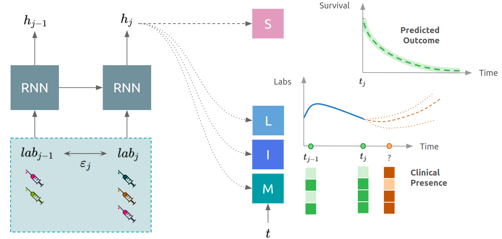

# ClinicalPresence
Code to reproduce the results of the paper [Robust Modelling of Clinical Presence using Deep Joint](). This paper shows how modelling the interaction between patient and the healthcare system in a multi task setting might improve both predictive performance and robustness to change in the observational process.

## Model
The model consists in a recurrent neural network with input each new observation. The embedding is then used for modelling the survival outcome using a DeepSurv model S, and in parallel the observation process:
- L: the longitudinal evolution using a neural network with output the mean and variance of the different laboratory tests.
- I: the inter-observation times using a temporal point process network with output the intensity function.
- M: the missingness process using a neural network with a Bernoulli output.



## How to use the model ?
To use the model, one needs to execute:
```python
from models import RNNJoint
model = RNNJoint(inputdim, outputdim, **hyperparameter)
model.fit(covariates, inter_observation, mask, event, time)
model.predict(covariates, inter_observation, mask)
```

## Reproduce paper's results
To reproduce the paper's results:

0. Clone the repository with dependencies: `git clone git@github.com:XX/ClinicalPresence.git --recursive`.
1. Create a conda environment with all necessary libraries `pytorch`, `pandas`, `numpy`.
2. Download the MIMIC III dataset and extracts data following `1. Temporal Lab Extraction.ipynb`.
3. Then sub select the laboratory of interest using `2. Analysis.ipynb`.
4. And finally run the experiments `3. Death - Survival.ipynb`, run the notebook with the different split of interest (weekend, weekday or random) -- `Script.py` allows to run this same set of experiments in command line.
5. Analyse the results using `4. Analysis Results.ipynb`.

## Compare to a new method
Adding a new method consists in adding a child to `Experiment` in `experiment.py` with functions to compute the nll and fit the model.
Then, add the method in `examples/experiments_paper.py` and follow the previous point. 
`TODOs` have been added to make the addition of a new method easier.

## Future directions
- Competing risks.

# Setup
## Structure
All models are in `models` folder, itself divided in the RNN structure, the Observational and Survival components. All scripts are at the root.

## Clone
```
git clone git@github.com:XX/ClinicalPresence.git --recursive
```

## Requirements
The model relies on `pytorch`, `pandas`, `numpy` and `tqdm`.  